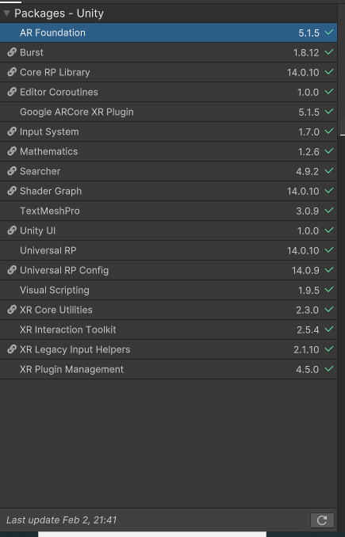

# Projet VR/AR : Equipe Yee-Haw

Membres : Bouhlel Ziad, Baratli Wassim, Pellegrini Romain, Merdaci Elias, Bourry Amir

  

Notre projet est composé de deux parties : une partie AR et une partie VR.

  

## IMPORTANT

Ce github est une copie du github original car nous avons eu des problèmes de configuration VR, nous ne sommes pas parvenu à build une scène VR sur le premier. Nous sommes donc reparti d'un projet vierge pour reconfigurer le projet de nouveau.

Lien du premier Github : https://github.com/Ziad-Bouhlel/Multimodal-Yee-Haw

  

## AR : Elias et Wassim

Pour la partie AR, nous avons réalisé les features suivantes :

- Permettre de sélectionner 2 SALLES, ET AVOIR UNE VISUALISATION DU TEMPS DE TRAJETS ENTRE 2 SALLES.

- Conception d'un menu en qui affiche la localisation des étudiants d'intérêt en les filtrant par année d'étude ou par spécialisation (IHM, MAM, AL, WD, etc.) ainsi que par le mode de transport préféré.

 - Ajout d'un bloc note pour écrire et saisir rapidement des informations sur un élève, une salle ou un objet.

Pour lancer l'application il suffit de build le projet sur un téléphone android, et le projet se lancera automatiquement sur le téléphone.

- En rapprochant le téléphone de la carte, à proximité des QR codes, des cercles bleus s'afficheront par dessus avec le numéro de la salle.

- Sur le coté de l'écran, se trouve un formulaire de filtres permettant de filtrer les salles disponibles et d'afficher le nombre d'étudiants de chaque salle.

  

### Bilan et prise de recul :

Au cours de ce projet, nous nous sommes concentrés sur la partie technique et le fonctionnement des fonctionnalités et avons négligés la partie IHM, et UX de l'appli. En terme d'améliorations et de recommandations, nous avons pris conscience de ce problème et nous avons amélioré le design de l'application en mettant des couleurs moins agressives et du texte plus lisible.

  
  

## VR : Amir, Romain et Ziad

  

Dans le cadre de la partie VR, nous avons implémenté les extensions suivantes :

  

- Manipulation des objets avec un dispositif multimodal : L'utilisateur peut interagir avec des objets dans l'environnement virtuel en utilisant les touches de sa manette. Il peut déplacer, agrandir/rétrécir, tourner et ajouter des objets dans son environnement.

- Changement d'apparence via un inventaire de personnages et tenues : L'utilisateur peut changer son apparence en sélectionnant différents personnage dans son inventaire, rendant l'expérience plus personnalisée.

- Support VR Headset : L'intégration complète avec un casque VR permet de plonger l'utilisateur dans l'environnement virtuel de manière plus immersive.
 
  

### Lancement de l'application :

L'application VR est utilisable avec un casque VR Meta Quest 3 et une manette connectée au casque. Pour utiliser l'application, il faut clone le projet, "add" le dossier projetARVR dans Unity Hub puis build sur le casque l'APK avec la plateforme Android (Build Settings déjà configurés, nécessite la plateforme Android installé dans Unity Hub). L'application se crée dans les apps du casque et peut être lancé directement.

Voici les package à installer : 

vidéo suivies pour build la VR (de 10 à 17 minutes) : 

  https://www.youtube.com/watch?v=rd-vObXRDNQ&t=643s&ab_channel=OlivierBecker

### Retours :

- Interface non adaptée au dispositif VR : L'interface, en particulier le canevas statique sur l'écran, ne suit pas les mouvements du joueur. Cela provoque un inconfort visuel, augmentant le motion sickness et surchargeant l'utilisateur avec trop d'informations à l'écran. De plus, les couleurs utilisées étaient trop vives et distrayantes.

- Positionnement de la caméra : La caméra était placée trop haut, ce qui ne correspondait pas à une perspective en première personne, nuisant à l'immersion. Elle aurait dû être au niveau des yeux du joueur pour une meilleure représentation de l'environnement.

  

### Améliorations :

Changement d'habits repensé : Pour résoudre les problèmes d'interface, nous avons abandonné le menu statique sur l'écran. Désormais, le menu de sélection des vêtements est placé sur un mur virtuel dans un "vestiaire". Le joueur doit se rendre dans cette zone spécifique pour interagir avec le menu, activé par un trigger. Cela réduit la surcharge d'informations à l'écran et améliore l'immersion.

  

Interface changée : Elle apparait en pressant la flèche du haut de la manette et peut être repositionné devant soit en la pressant à nouveau. Le panel pour afficher les information d'un objet apparait maintenant devant l'objet visé.